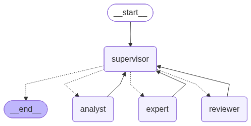
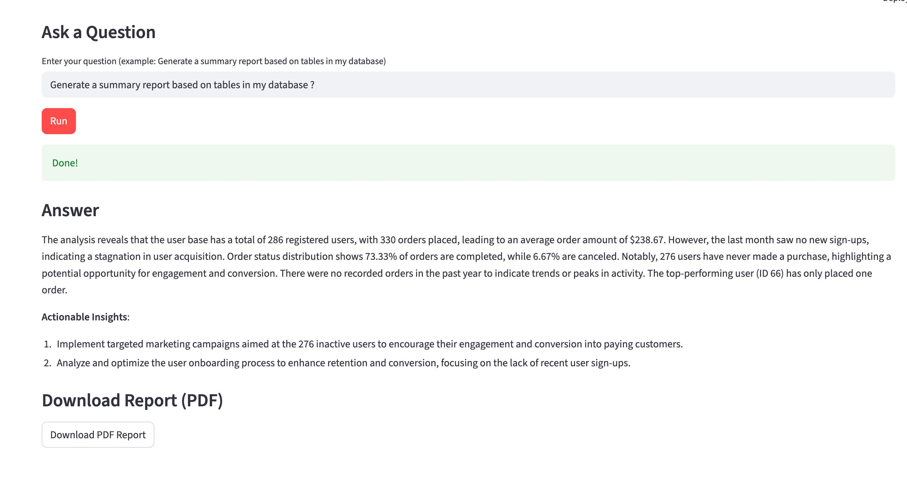

# Multi Role System for SQL Query Execution (Analyst → Expert → Reviewer)


This project is a **multi-agent (multi-role) LLM workflow** that:
1) **Analyzes** a SQLite database schema (Analyst)  
2) **Queries** the database to answer analytical questions (Expert)  
3) **Summarizes** results into a presentation-ready output (Reviewer)  
4) Lets you **download the final response as a PDF** via a Streamlit UI  

The backend is orchestrated with **LangGraph** and uses **OpenAI chat models** via `langchain-openai`.

---

## Workflow Graph

<p align="center">
  
</p>

---

## AWS Deployment Screenshot
<p align="center">
   
  
</p>

 
<p align="center">
  
  ## Project Report

📥 *[Click here to view the Project Report (PDF)](assets/report(3).pdf)*

</p>

## What’s inside

### Core components
- **SQLite database (`shop.db`)**  
  Created/used at runtime. Includes two tables:
  - `users(id, name, email, signup_date)`
  - `orders(id, user_id, amount, status, order_date)`

- **Tools**
  - `get_schema()` → returns table schemas via `PRAGMA table_info(...)`
  - `execute_sql(query)` → executes SQL on SQLite and returns results as text
  - PDF generation helper → converts final text to a downloadable PDF (FPDF)

- **Agents**
  - **Analyst Agent**
    - Uses `get_schema()`
    - Produces **at least 10 insightful questions** to guide the report
  - **Expert Agent**
    - Uses `get_schema()` and `execute_sql()`
    - Answers analyst questions by running SQL (**no summarization**)
  - **Reviewer Agent**
    - Produces a concise summary in **exactly 8 lines**
    - Adds **2 actionable insights** at the end

- **Supervisor (Router)**
  - Coordinates the workflow and routes through:  
    `Analyst → Expert → Reviewer → END`
  - Enforces that each node is visited at least once

- **Streamlit UI (`app.py`)**
  - Shows a workflow graph (best-effort)
  - Text input for a question
  - Runs the full pipeline
  - Download button for the final PDF report

---

## Project structure

> This repository currently centers on a single file:

- `app.py` — DB initialization + tools + LangGraph multi-agent workflow + Streamlit UI  
- `shop.db` — SQLite database file created/updated when the app runs  

---

## Requirements

- Python **3.10+** (recommended)
- An OpenAI API key

Python packages:
- `streamlit`
- `langchain`
- `langgraph`
- `langchain-openai`
- `fpdf`
- `pillow`

---

## Setup

### Create and activate a virtual environment
```bash
python -m venv .venv
source .venv/bin/activate  # macOS/Linux


---

### Clone the Repository
git clone (https://github.com/thanusri1601/Multi-Role-System-for-SQL-Query-Execution.git)  
cd ~Multi_agent


---

### Install Dependencies
pip install --upgrade pip  
pip install -r requirements.txt  

---

## Running the Application

### Local Execution
streamlit run app.py  

---

## AWS EC2 Deployment

This project is deployed on an AWS EC2 Ubuntu instance.

### Deployment Steps
1. Launch an Ubuntu EC2 instance  
2. Open port 8501 in the EC2 security group  
3. Clone this repository on the EC2 instance  
4. Create and activate a Python virtual environment  
5. Install required dependencies  
6. Run the Streamlit application  

Run the application on EC2 using:
streamlit run app.py --server.port 8501 --server.address 0.0.0.0  

## Live Deployment
http://ec2-3-91-215-180.compute-1.amazonaws.com:8501/

## Output

- Interactive Streamlit-based user interface  
- Multi-agent workflow  
- Reduced hallucinations through validation and corrective retrieval, execution, summarization and downloadable report 
- Publicly accessible AWS EC2 deployment  

---

## Technologies Used

- Python  
- LangChain  
- LangGraph  
- FAISS Vector Store  
- OpenAI API  
- Streamlit  
- AWS EC2  

---


## Author

Thanusri A  
